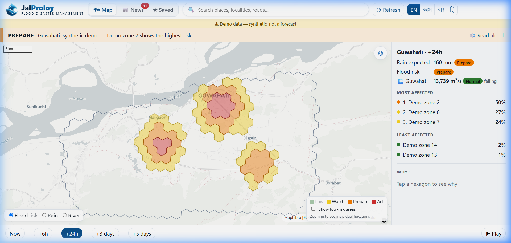
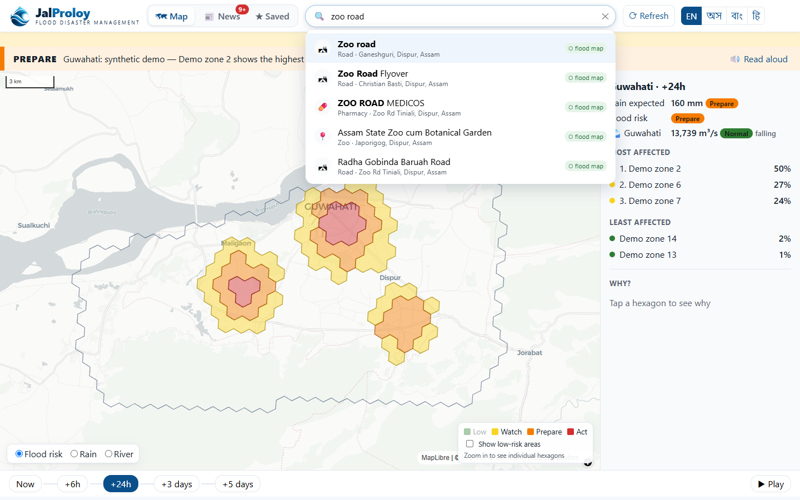
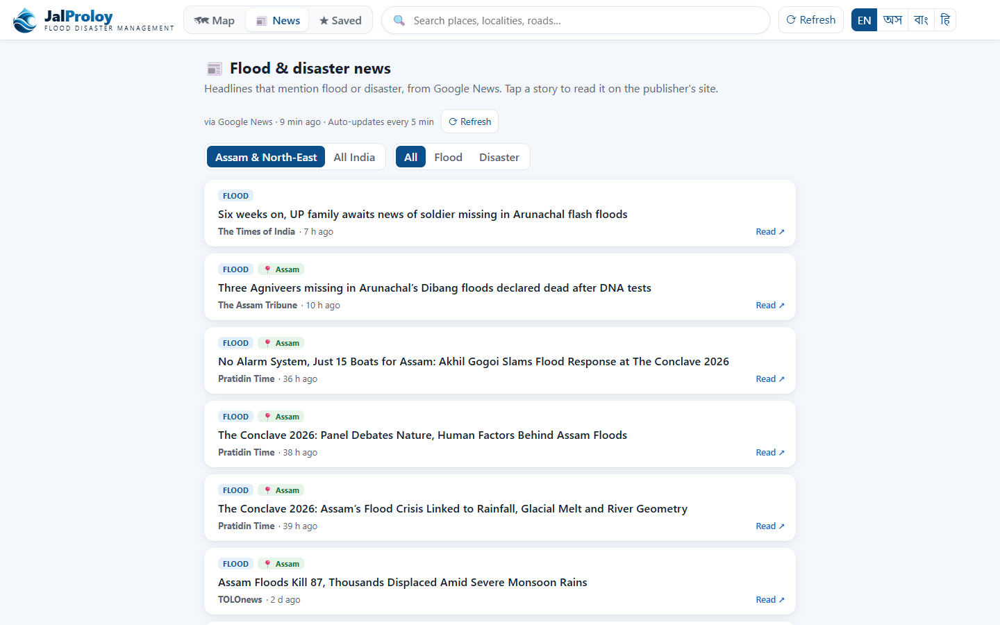
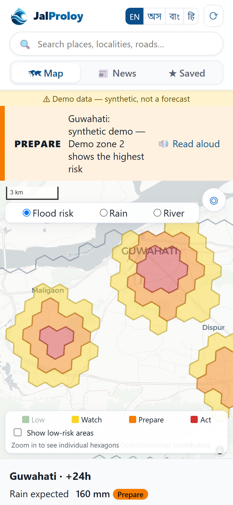
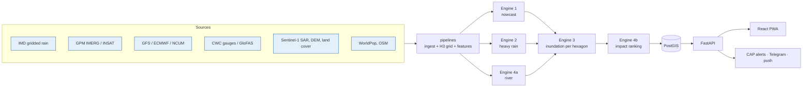

<div align="center">


### AI/ML-based heavy-rainfall early warning and hyperlocal flood prediction for Assam

[](#problem-statement)
[](#problem-statement)


**Will it rain heavily? Where will the water collect? Who will be hurt most?**<br>
JalProloy answers all three in five seconds, for a farmer on a phone or an official on a desktop,<br>
in English, Assamese, Bengali and Hindi.

[Features](#features) · [Architecture](#architecture) · [Quick start](#quick-start) · [API](#api) · [Documentation](#documentation) · [Roadmap](#project-status--roadmap)

</div>

---

<p align="center">
  
</p>

## Problem statement

> **SIH PS 26071 — AI/ML-Based Integrated Heavy Rainfall Early Warning and Inundation Prediction System** using satellite,
> radar, observational weather and numerical weather prediction (NWP) data.
> *Ministry of Earth Sciences (MoES) · India Meteorological Department (IMD) · Theme: Disaster Management*

Assam floods every monsoon. Warnings today are issued per district, while waterlogging and river floods happen street by
street. JalProloy fuses satellite rainfall, weather-model forecasts, river gauges, terrain and radar-derived flood history
into **per-hexagon (0.1–0.7 km²) flood probabilities** for the next 6 hours to 5 days. It ranks the most and least affected
localities, and explains every warning in plain language.

## Features

| | Feature | Details |
|---|---------|---------|
| 🗺️ | **Hyperlocal risk map** | H3 hexagons over Guwahati (pilot) and Assam; same-risk cells merge into calm zones at city zoom and split into cells when zoomed in |
| 🎨 | **IMD colour scale** | Green / Yellow / Orange / Red, always paired with *Low / Watch / Prepare / Act* for colour-blind users |
| ⏱️ | **One timeline** | Now · +6 h · +24 h · +3 days · +5 days; the map, banner and rankings all follow it |
| 🧠 | **Explainable** | Tap a hexagon for the *why*: low-lying ground, recent rain, river state (SHAP-based) |
| 🔍 | **Google-Maps-style search** | Suggestions as you type for any locality, road, village or hospital in NE India; drops a pin and opens its risk |
| 🌊 | **Brahmaputra river watch** | Six main-stem gauges, flow vs the same season over 10 years, 7-day forecast peak |
| 🌧️ | **Rain outlook** | 7-day rain against the IMD "heavy" line; Assam towns ranked by wettest day |
| 📰 | **News tab** | Live flood and disaster headlines (Google News, GDELT fallback), unread badge, opens the publisher's page |
| 🛰️ | **Regional flood events** | GDACS alerts for NE India and neighbouring countries |
| 🔔 | **Alerts** | CAP 1.2 XML (the format NDMA's SACHET uses), Telegram, web push; subscribe by level |
| 🌐 | **4 languages + read aloud** | English, অসমীয়া, বাংলা, हिन्दी |
| 📴 | **Offline-first PWA** | The last forecast and emergency numbers stay available when the network fails |
| 🧾 | **Honest by design** | Every number carries its source and freshness (live / cached / offline / demo) |

<table>
  <tr>
    <td width="50%"><p align="center"><sub>Search-as-you-type across OpenStreetMap</sub></p></td>
    <td width="50%"><p align="center"><sub>Live flood &amp; disaster news</sub></p></td>
  </tr>
</table>

<p align="center"><br><sub>Mobile / PWA</sub></p>

## Architecture

JalProloy is built as **four ML engines** whose outputs are fused per hexagon and served by a FastAPI backend to a React PWA.

| # | Engine | Answers | Horizon | Approach |
|---|--------|---------|---------|----------|
| 1 | **Rainfall nowcasting** | Where is rain now, and where is it moving? | 0–6 h | pySTEPS optical flow on IMERG / INSAT / radar → ConvLSTM |
| 2 | **Heavy-rainfall forecast** | P(heavy / very heavy / extremely heavy rain), IMD categories | 1–5 days | LightGBM bias correction of GFS / ECMWF / NCUM against IMD gridded rainfall |
| 3 | **Inundation prediction** | Which hexagon floods? | 6 h–5 days | Terrain (HAND, slope, TWI, land cover) + rain + river → gradient boosting, trained on Sentinel-1 SAR flood maps |
| 4 | **River propagation & impact** | Which place downstream floods next; who is most affected? | 6 h–5 days | Upstream-gauge lag model; expected affected population = P(flood) × population |



**Key design choices**
- **H3 hexagons** are the unit of prediction everywhere: resolution 8 (~0.7 km²) state-wide, resolution 9 (~0.1 km²) in cities.
- **Models run on a schedule, never per request.** The API serves the latest completed run, so it stays fast when everyone opens the app during a flood.
- **Validation by held-out year** (2022 hindcast), with persistence and raw-NWP baselines beside every score (CSI, POD, FAR, Brier, NSE).

## Tech stack

| Layer | Technologies |
|-------|--------------|
| ML & data | Python 3.11, xarray, rioxarray, GeoPandas, h3, scikit-learn, LightGBM, SHAP, pySTEPS, PyTorch, WhiteboxTools, Google Earth Engine |
| Backend | FastAPI, Pydantic v2, SQLAlchemy 2 + GeoAlchemy2, PostgreSQL 16 + PostGIS, Redis, httpx, APScheduler |
| Frontend | React 18, TypeScript, Vite, MapLibre GL, deck.gl, h3-js, Service Worker (PWA) |
| Ops | Docker Compose, conda (`environment.yml`) |

## Quick start

### Prerequisites
- **Python 3.11** (via [Miniforge](https://github.com/conda-forge/miniforge) for the ML stack; the backend alone needs only pip)
- **Node.js 20+**
- **Docker Desktop** (optional, for PostGIS + Redis)

### 1. Clone and configure
```bash
git clone https://github.com/<your-org>/jalproloy.git
cd jalproloy
cp .env.example .env
```

### 2. Run the backend (demo mode)
```bash
cd backend
python -m venv .venv
.venv\Scripts\activate          # Windows  (macOS/Linux: source .venv/bin/activate)
pip install -r requirements.txt
uvicorn app.main:app --port 8000
```
API docs: <http://localhost:8000/docs>

### 3. Run the frontend
```bash
cd frontend
npm install
npm run dev
```
Open <http://localhost:5173>.

### Or everything with Docker
```bash
docker compose up                       # db, redis, backend, frontend
docker compose --profile live up -d     # + scheduler for live data sync
```

> **Demo mode.** Until the engines are trained, the flood hexagons come from a clearly labelled **synthetic** provider
> (`"source": "synthetic-demo"`, with a notice in the UI). Rain outlook, river watch, flood events, news and search already
> use **real live data**.

### ML / data environment
```bash
conda env create -f environment.yml
conda activate jalproloi
pip install -e .
```
Then follow the build order in [Documentation](#documentation), starting with [docs/00_SETUP.md](docs/00_SETUP.md).

### Configuration

Key variables (see [`.env.example`](.env.example) for the full list):

| Variable | Purpose |
|----------|---------|
| `DEMO_MODE` | `true` serves synthetic flood hexagons; `false` reads model runs from PostGIS |
| `DATABASE_URL`, `REDIS_URL` | Serving database and cache |
| `EARTHDATA_USERNAME/PASSWORD` | NASA Earthdata (GPM IMERG) |
| `GEE_PROJECT` | Google Earth Engine project (Sentinel-1, DEM, land cover) |
| `CAP_STATUS` | `Exercise` for demos, `Actual` only for operational alerts |
| `TELEGRAM_BOT_TOKEN` | Telegram alert channel |
| `PHOTON_API`, `API_URL`, `HEALTHCHECK_URL` | Search backend, cache warm-up target, scheduler heartbeat |

## API

| Method | Endpoint | Description |
|--------|----------|-------------|
| `GET` | `/api/risk/area?name=Guwahati&horizon=24h` | Area summary: rain, flood level, most/least affected |
| `GET` | `/api/risk/area/cells?name=…&horizon=…` | Every hexagon for the map |
| `GET` | `/api/risk/cell/{h3}` | One hexagon with its explanation |
| `GET` | `/api/areas/suggest?q=…` | Search-as-you-type suggestions |
| `GET` | `/api/areas/locate?lat=…&lon=…` | "My location": coverage and nearest town |
| `GET` | `/api/outlook/rain?lat=…&lon=…` | 7-day rain outlook |
| `GET` | `/api/outlook/towns` | Assam towns ranked by wettest day |
| `GET` | `/api/rivers` | Brahmaputra river watch |
| `GET` | `/api/events` | Regional flood events (GDACS) |
| `GET` | `/api/news?scope=assam\|india` | Flood & disaster headlines |
| `GET` | `/api/alerts`, `/api/alerts/{id}/cap` | Active alerts, CAP 1.2 XML |
| `GET` | `/api/status` | Freshness of every data source |

Full schemas: <http://localhost:8000/docs> (OpenAPI).

## Project structure

```
jalproloy/
├── backend/            FastAPI app: API routes, live-data services, CAP alerts, PostGIS models, tests
├── frontend/           React + TypeScript PWA: map, search, slides, news, i18n (en/as/bn/hi)
├── ml/
│   ├── common/         shared config, IMD thresholds & colours, H3 grid helpers
│   ├── nowcast/        Engine 1: pySTEPS baseline, ConvLSTM
│   ├── rainfall_forecast/  Engine 2: NWP bias-correction (LightGBM)
│   ├── inundation/     Engine 3: susceptibility, dynamic flood model, SHAP explanations
│   ├── river_routing/  Engine 4a: upstream-gauge lag model
│   ├── impact/         Engine 4b: exposure & risk ranking
│   └── evaluation/     CSI / POD / FAR / Brier / NSE, hindcast replay
├── pipelines/          ingestion (IMD, IMERG, NWP, rivers), H3 grid, terrain features, Earth Engine, scheduler
├── data/               local data lake (git-ignored; see data/README.md)
├── docs/               build guides, model-card template, screenshots
├── docker-compose.yml
└── environment.yml
```

## Testing

```bash
cd backend && pytest          # API, CAP, live-data parsing, search, news (network calls mocked)
pytest ml/tests               # IMD categories, colour rules, verification metrics
cd frontend && npm run build  # type-check + production bundle
```

## Documentation

| Guide | What it covers |
|-------|----------------|
| [00 · Setup](docs/00_SETUP.md) | Environments, accounts, first run |
| [01 · Architecture](docs/01_ARCHITECTURE.md) | Data flow, engine contracts, storage, conventions |
| [02 · Data sources](docs/02_DATA_SOURCES.md) | Every dataset, access, latency, known traps |
| [Engine 1 · Nowcast](docs/ENGINE_1_NOWCAST.md) | pySTEPS → ConvLSTM, verification vs persistence |
| [Engine 2 · Heavy rain](docs/ENGINE_2_RAINFALL_FORECAST.md) | NWP bias correction, IMD categories, calibration |
| [Engine 3 · Inundation](docs/ENGINE_3_INUNDATION.md) | HAND, Sentinel-1 labels, susceptibility (Milestone 1), dynamic model |
| [Engine 4 · River & impact](docs/ENGINE_4_RIVER_IMPACT.md) | Gauge lags, HAND-based inundation, expected affected population |
| [07 · Integration & API](docs/07_INTEGRATION_API.md) | Fusing engines per horizon, API contracts |
| [08 · Alerts & CAP](docs/08_ALERTS_CAP.md) | CAP 1.2 mapping, alert logic, channels |
| [09 · Validation & hindcast](docs/09_VALIDATION_HINDCAST.md) | Leakage rules, metrics, the hindcast demo |
| [10 · Frontend](docs/10_FRONTEND.md) | UI principles, de-cluttering decisions, component map |
| [11 · Roadmap](docs/11_ROADMAP.md) | 7-week plan and team roles |
| [12 · Live data sync](docs/12_LIVE_DATA_SYNC.md) | Keeping the app updated from every source |

## Project status & roadmap

| Component | Status |
|-----------|--------|
| Web app (map, search, slides, news, i18n, PWA) | ✅ Working |
| Live public data (rain outlook, river watch, GDACS, news, search) | ✅ Live |
| CAP 1.2 alert generation | ✅ Working (status `Exercise`) |
| Data pipelines & engine code | 🧩 Implemented as documented skeletons, awaiting data |
| Engine 3 static susceptibility (Milestone 1) | ⏳ Next |
| Engines 1, 2, 4 training and validation | ⏳ Planned |
| Hindcast of the 2022 Assam floods | ⏳ Planned |
| Telegram / SMS / web-push delivery | 🚧 Telegram ready; SMS and push planned |

See [docs/11_ROADMAP.md](docs/11_ROADMAP.md) for the week-by-week plan.

## Data sources & attribution

IMD gridded rainfall · NASA GPM IMERG · ISRO MOSDAC INSAT-3D/3DR · NOAA GFS · ECMWF open data · NCMRWF NCUM ·
CWC / India-WRIS · GloFAS via [Open-Meteo](https://open-meteo.com) · Copernicus Sentinel-1 & DEM · ESA WorldCover ·
JRC Global Surface Water · ERA5-Land · WorldPop · [GDACS](https://www.gdacs.org) · Google News / GDELT ·
© [OpenStreetMap](https://www.openstreetmap.org/copyright) contributors, [Photon](https://photon.komoot.io), CARTO basemaps.

Each source is subject to its own licence; see [docs/02_DATA_SOURCES.md](docs/02_DATA_SOURCES.md) and
[docs/12_LIVE_DATA_SYNC.md](docs/12_LIVE_DATA_SYNC.md) before any non-research use.

## Contributing

1. Create a branch from `main` (`feature/<short-name>`).
2. Keep shared constants in `ml/common/config.py` and `ml/common/imd.py`, not scattered through the code.
3. Run the tests above before opening a pull request.
4. Never commit secrets or data. `.gitignore` already excludes `.env`, `data/`, model artifacts and credentials.

## Disclaimer

JalProloy is an **experimental research prototype** built for Smart India Hackathon. It is **not an official warning
system**. Always follow advisories from the [India Meteorological Department](https://mausam.imd.gov.in) and the
[Assam State Disaster Management Authority](https://asdma.assam.gov.in). In an emergency, call **112**, **1070** (state)
or **1077** (district).

## License

No licence has been chosen yet, so all rights are reserved by the authors until a `LICENSE` file is added.
# JALPRALOY

