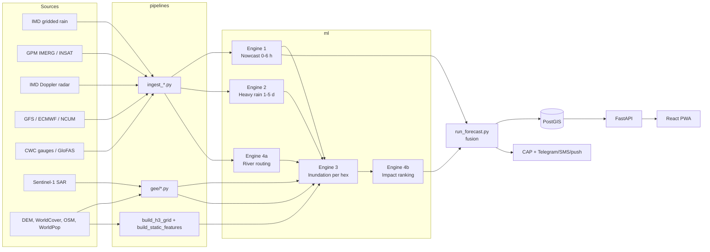

# 01 · Architecture

## Data flow



**Key principle:** models run on the scheduler, never on an API request. The API serves the
latest completed run from PostGIS, so it stays fast when everyone opens the app during a flood.

## The unit of prediction: H3 hexagons

- Res 8 (~0.74 km²) covers all of Assam (~100k cells). Res 9 (~0.1 km²) covers the Guwahati pilot.
- Every engine output is eventually expressed per `h3` cell. Coarse inputs (IMD 0.25°, IMERG 0.1°)
  are mapped to cells by nearest grid point. Engine 3 adds the local detail from terrain.
- Cells roll up to locality → circle → district → state by `h3.cell_to_parent` or by polygon join.

## Engine contracts

Every engine writes parquet/NetCDF under `data/processed/forecasts/<run_id>/`, where
`run_id = issue time YYYYmmddHHMM (UTC)`. Keep these column names stable, because the other engines depend on them.

| Engine | File | Columns / variables |
|--------|------|--------------------|
| 1 Nowcast | `nowcast_<method>.nc` | `rain_mmh(lead, lat, lon)`, `exc_prob(threshold, lead, lat, lon)`, `u, v(lat, lon)` |
| 1 → cells | `nowcast_cells.parquet` | `h3, rain_mm_6h, eta_min, p_rain_gt_10mmh` |
| 2 Rain | `rainfall_cells.parquet` | `h3, lead_day, p_heavy, p_very_heavy, p_extreme, rain_mm_expected, color` |
| 4a River | `river.parquet` | `station, horizon_h, level_m, above_warning, above_danger, text` |
| 3 Inundation | `inundation_cells.parquet` | `h3, horizon, p_flood, drivers (json list)` |
| 4b Impact | `impact_areas.parquet` | `area, level, horizon, p_flood_popweighted, expected_affected_pop, color, rank` |

## Storage

| What | Format | Where |
|------|--------|-------|
| Gridded time series (rain, NWP, soil moisture) | NetCDF / Zarr, dims `time, lat, lon`, lat ascending | `data/processed/grids`, `data/processed/nwp` |
| Rasters (DEM, HAND, landcover) | GeoTIFF (COG ideal) | `data/raw/gee`, `data/processed/terrain` |
| Per-cell tables | Parquet with `h3` column | `data/processed/h3`, `features`, `training` |
| Serving | PostGIS | tables in `backend/app/db/models.py` |
| Models | joblib / .pt + `*_meta.json` + scores CSV | `ml/models/<engine>/` |

## Conventions

- **Time:** store UTC everywhere; convert to IST only in the UI. IMD's rainfall day is the 24 h ending
  **03 UTC (08:30 IST)**, so all "daily" NWP aggregates use 03–03 UTC windows.
- **Units:** mm (accumulation), mm/h (rate), m (level), m³/s (discharge), probabilities 0–1.
- **Colours:** only `green | yellow | orange | red`, always shown with the word `Low | Watch | Prepare | Act`.
  Rules live in `ml/common/imd.py` (mirrored in `backend/app/core/imd.py`).
- **Config:** region, grids, splits and paths live in `ml/common/config.py`. Don't hard-code them elsewhere.
- **Source flag:** every API payload carries `source: "model" | "synthetic-demo"`.

## Database tables (serving only)

```
runs(id, issue_time, kind, sources)                    one row per fused forecast
cells(h3, res, district, locality, population, susceptibility, geom)
areas(id, name, level, parent_id, lgd_code, geom)
cell_forecasts(run_id, h3, horizon, rain_mm, p_*, p_flood, color, eta_min, drivers)
area_forecasts(run_id, area_id, horizon, rain_mm, p_flood_*, expected_affected_pop, rank, color)
alerts(id, area_id, run_id, color, headline, issued, onset, expires, msg_type, cap_xml)
saved_places(id, user_ref, name, h3, channels, contact, last_color_sent)
```

Keep only the last ~10 operational runs in `cell_forecasts`. Hindcast runs are stored with `kind='hindcast'`.

## Cadence

| Job | Every | Triggers |
|-----|-------|----------|
| Satellite rain + Engine 1 + fuse | 30 min | new IMERG/INSAT frame |
| NWP + Engine 2 + fuse | 6 h | GFS 00/06/12/18 UTC (~4–5 h latency) |
| River levels + Engine 4a + fuse | 1 h | |
| IMD daily grid | daily ~10:15 IST | antecedent rain for Engine 3 |

Implemented in `pipelines/scheduler.py` (APScheduler).
